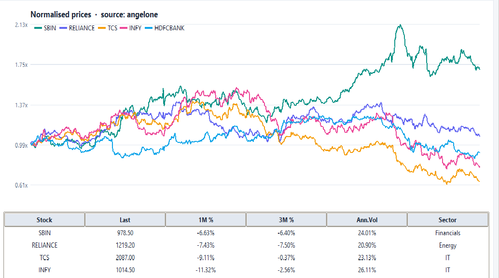
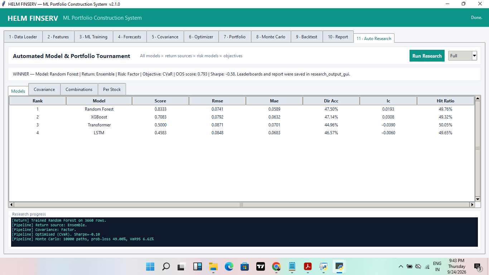
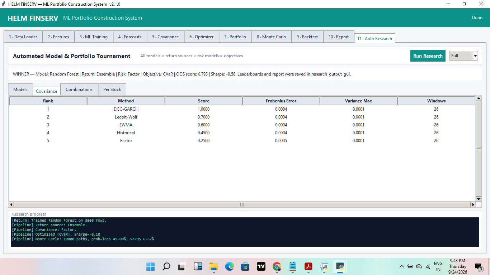
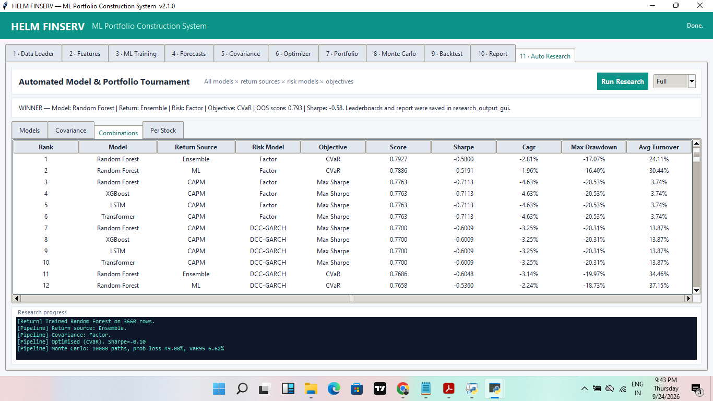
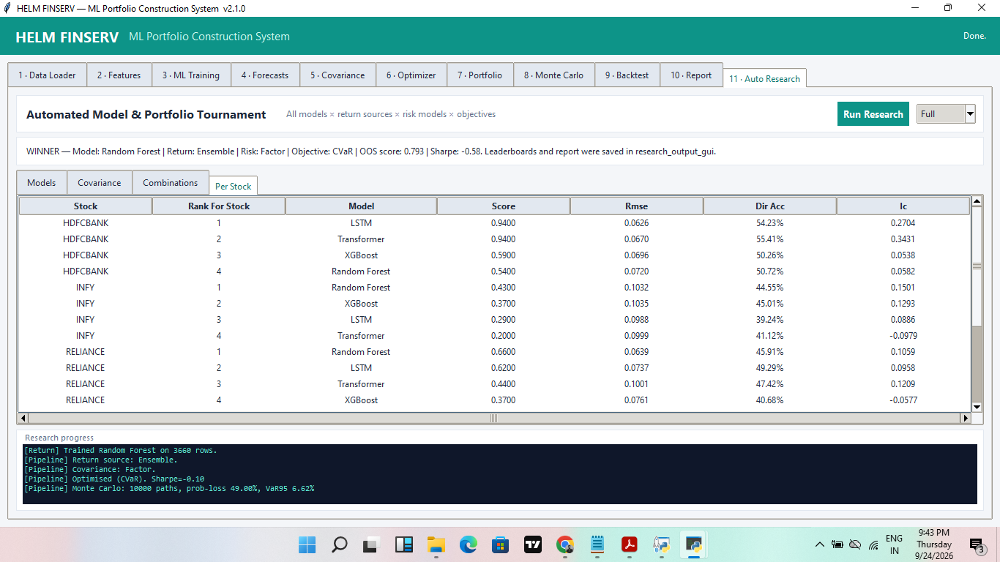

# HELM FINSERV — ML Portfolio AutoResearch

An end-to-end quantitative portfolio research desktop application that compares
machine-learning forecasts, expected-return frameworks, covariance estimators
and portfolio objectives using purged walk-forward validation.

The system is designed to answer a practical research question:

> Which complete model × return source × risk model × optimization objective
> performs most consistently out of sample?

It is a research and educational project—not an investment recommendation.

## Highlights

- Real NSE historical data through Angel One SmartAPI or offline synthetic data
- Sixteen technical, risk, momentum, valuation and sentiment features
- Random Forest, XGBoost, LSTM and Transformer forecasting models
- ML, CAPM, factor, Black–Litterman and ensemble expected returns
- Historical, EWMA, Ledoit–Wolf, DCC-GARCH and factor covariance estimators
- Maximum Sharpe, minimum variance, Markowitz, risk parity, CVaR and robust objectives
- Purged expanding-window validation and outer walk-forward portfolio testing
- Model, covariance, full-combination and per-stock leaderboards
- Constraint-aware allocation, transaction costs and turnover measurement
- Monte Carlo VaR, CVaR, probability-of-loss and drawdown analysis
- Single-file Tkinter application with an integrated **Auto Research** tab

## Research workflow

1. Load historical prices and fundamentals.
2. Engineer predictive features and 21-trading-day targets.
3. Validate every available forecasting model with time-series folds.
4. Compare covariance forecasts against subsequently realized covariance.
5. At each outer walk-forward date, train only on past information.
6. Evaluate every requested return × risk × objective configuration.
7. Rank configurations using return, downside risk, turnover, concentration and stability.
8. Refit the selected configuration and produce allocation, Monte Carlo and report outputs.

In full mode, the current five return sources, five risk models, six objectives
and four forecasting models produce up to 600 recorded configurations per
walk-forward window. Some CAPM/factor rows are mathematically duplicated across
the model label because those return sources do not use the selected ML model.

## Screenshots

### Real-market data



### ML model leaderboard



### Covariance leaderboard



### Full portfolio-combination leaderboard



### Per-stock model research



## Installation

Python 3.10 or newer is recommended.

```bash
git clone https://github.com/YOUR_USERNAME/HELM-ML-Portfolio-AutoResearch.git
cd HELM-ML-Portfolio-AutoResearch
python -m venv .venv
```

Windows:

```bash
.venv\Scripts\activate
python -m pip install --upgrade pip
pip install -r requirements.txt
```

## Run the application

```bash
python helm_portfolio_autoresearch.py
```

Inside the application:

1. Load synthetic data or connect a real Angel One data source in Tab 1.
2. Open **11 · Auto Research**.
3. Select **Fast** for a short engineering check or **Full** for the complete tournament.
4. Click **Run Research**.
5. Review the model, covariance, combination and per-stock leaderboards.

The winning configuration is loaded into the Forecast, Optimizer, Portfolio,
Monte Carlo and Report tabs. Exported outputs are written to
`research_output_gui/`.

## Headless commands

Full automated research:

```bash
python helm_portfolio_autoresearch.py --research --mode full --history 750
```

Fast research check:

```bash
python helm_portfolio_autoresearch.py --research --mode fast --history 360
```

Numerical regression suite:

```bash
python helm_portfolio_autoresearch.py --selftest
```

The current release passes 33 numerical checks covering data, features,
forecasting, covariance PSD properties, optimization constraints, Monte Carlo,
walk-forward backtesting and report generation.

## Optional Angel One configuration

Credentials can be entered at runtime or provided as environment variables:

```text
ANGEL_API_KEY
ANGEL_CLIENT_ID
ANGEL_PASSWORD
ANGEL_TOTP_SECRET
```

Never commit credentials, screenshots containing credentials, `.env` files or
generated access tokens.

## Interpreting the included sample

The included sample report demonstrates that the framework is willing to
produce an unfavorable result. Its highest-ranked configuration still had a
negative out-of-sample Sharpe ratio and negative CAGR. The composite score is a
relative ranking score—not prediction accuracy, probability of profit or an
expected return.

This is an important quantitative conclusion: the tested candidates did not
provide sufficient evidence of deployable alpha. A production system should
add an absolute acceptance gate and allow the result **NO TRADE / HOLD CASH**.

See [`docs/sample_research_report.txt`](docs/sample_research_report.txt) for the
complete example output.

## Current limitations

- The default universe contains only five stocks.
- Per-stock winning models are reported but are not yet combined into a dedicated return source.
- Model hyperparameters are not exhaustively tuned inside each outer window.
- CAPM and factor sources generate duplicate rows across ML model labels.
- The factor-return implementation is a lightweight proxy rather than a full institutional factor dataset.
- Monte Carlo output is scenario analysis, not proof of future performance.
- Final deployment requires longer data, a broader universe, realistic market impact and an untouched holdout.

## Security

Review [`SECURITY.md`](SECURITY.md) before using a broker connection. The
screenshots included here do not display credentials.

## License

Released under the MIT License. See [`LICENSE`](LICENSE).

